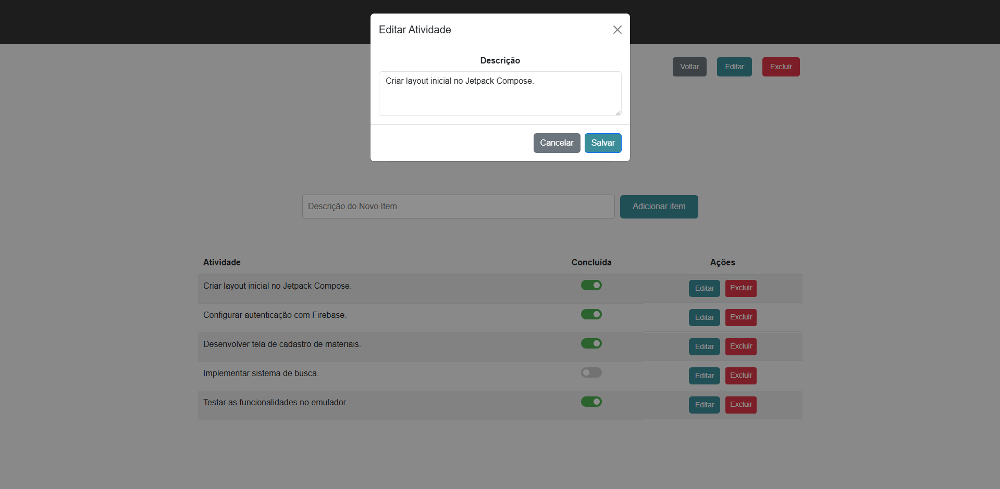

<h1 align="center">Taskify :clipboard:</h1>

Este repositório contém uma aplicação **To-Do List** desenvolvida utilizando **Ruby on Rails**. O objetivo do projeto é permitir a criação de várias listas de tarefas, onde cada lista pode conter múltiplos itens. A aplicação possui front-end e back-end integrados, proporcionando uma experiência simples e intuitiva.

## Instalação e Configuração

Siga os passos abaixo para configurar e executar o projeto localmente:

1. **Clone o repositório**:
    ```bash
    git clone https://github.com/thedouglasaraujo/to-do-list-ruby-on-rails.git
    ```

2. **Acesse o diretório do projeto**:
    ```bash
    cd seu_repositorio
    ```

3. **Instale as dependências**:
    ```bash
    bundle install
    ```

4. **Configure o banco de dados**:
    ```bash
    rails db:migrate
    ```

5. **Inicie o servidor**:
    ```bash
    rails server
    ```

6. **Acesse a aplicação**:

   Abra o navegador e acesse [http://localhost:3000](http://localhost:3000) para visualizar a aplicação em execução.

## :camera: Imagens
 <p align="center">
  
  
  
  
  
  
  
</p>
